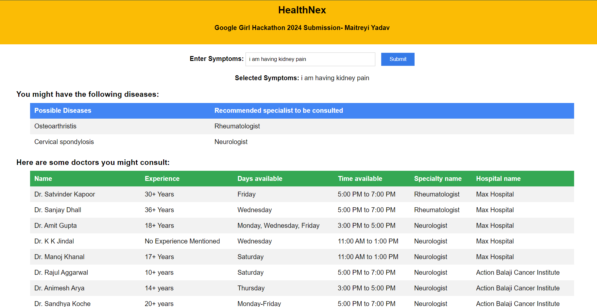
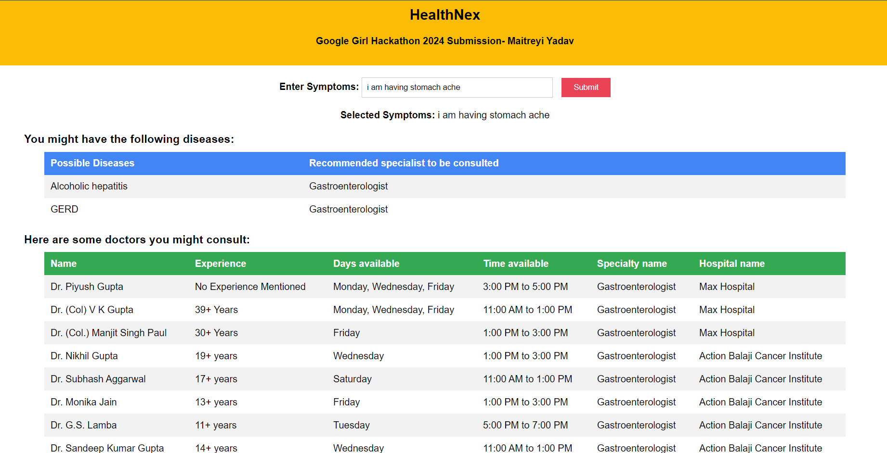

# HealthNex- Disease prediction software, with Doctor suggestions

This is my submission for the Google Girl hackathon 2024.

The problem statement entails developing a healthcare recommendation system to assist users in locating suitable
doctors based on their symptoms. Utilizing data from real hospital websites, the system captures information such
as doctor names, specialties, and schedules. Users input symptoms in layman's terms, which undergo processing to
extract keywords, subsequently matched against an existing dataset using cosine similarity. The system then
recommends doctors whose specialties align with the user's symptoms and have compatible schedules.
To achieve this, I have employed spaCy, a free open-source library for Natural Language Processing in Python.
Leveraging spaCy's capabilities enhances the accuracy and efficiency of symptom processing, allowing for precise
extraction of relevant keywords from user input.
This solution enhances user experience by simplifying symptom input and ensuring precise doctor
recommendations based on real-world data. Through the utilization of cosine similarity, the backend efficiently
identifies relevant doctors based on symptom matching, thereby streamlining the recommendation process. By
leveraging real hospital website data, the system ensures the reliability and authenticity of the recommended
doctors' information, thereby fostering trust among users.
Overall, this solution provides an effective and user-friendly platform for individuals seeking medical assistance
tailored to their specific symptoms and preferences, facilitated by the integration of spaCy for natural language
processing.

## Sample Project images

## How to run-

### 1. Frontend

FRONTEND- run python server as mentioned below, and open http://localhost:8000/

### 2. REST API

API- Send POST Request to this endpoint
`   http://localhost:8000/api/recommend-doc
  `

- Sample Input
  
  {
      "symptoms" : "leg pain with difficulty to walk"
  }
  
- Sample Output

  `{
  "data": [
      {
          "Osteoarthristis": "Rheumatologist"
      },
      {
          "Cervical spondylosis": "Neurologist"
      }
  ],
  "doctors": [
      [
          {
              "name": "Dr. Satvinder Kapoor",
              "experience": "30+ Years",
              "days_available": "Friday",
              "time_available": "5:00 PM to 7:00 PM",
              "specialty_name": "Rheumatologist",
              "hospital_name": "Max Hospital"
          },
          {
              "name": "Dr. Sanjay Dhall",
              "experience": "36+ Years",
              "days_available": "Wednesday",
              "time_available": "5:00 PM to 7:00 PM",
              "specialty_name": "Rheumatologist",
              "hospital_name": "Max Hospital"
          }
      ],
      [
          {
              "name": "Dr. Amit Gupta",
              "experience": "18+ Years",
              "days_available": "Monday, Wednesday, Friday",
              "time_available": "3:00 PM to 5:00 PM",
              "specialty_name": "Neurologist",
              "hospital_name": "Max Hospital"
          },
          {
              "name": "Dr. K K Jindal",
              "experience": "No Experience Mentioned",
              "days_available": "Wednesday",
              "time_available": "11:00 AM to 1:00 PM",
              "specialty_name": "Neurologist",
              "hospital_name": "Max Hospital"
          },
      ]
  ]
  }
  `

## To run this on local machine
Ensure that python is installed on your machine.

Clone the repository and cd in the root directory of repository.

1. python -m venv venv
2. Activate your virtual environment(windows- ./venv/scripts/activate)
3. pip install -r requirements.txt
4. python -m pip install https://s3-us-west-2.amazonaws.com/ai2-s2-scispacy/releases/v0.5.1/en_core_sci_md-0.5.1.tar.gz
5. cd DiseasePredictor
6. python manage.py runserver 8000

Now either use POSTMAN to test the Rest API, or open localhost:8000/.

